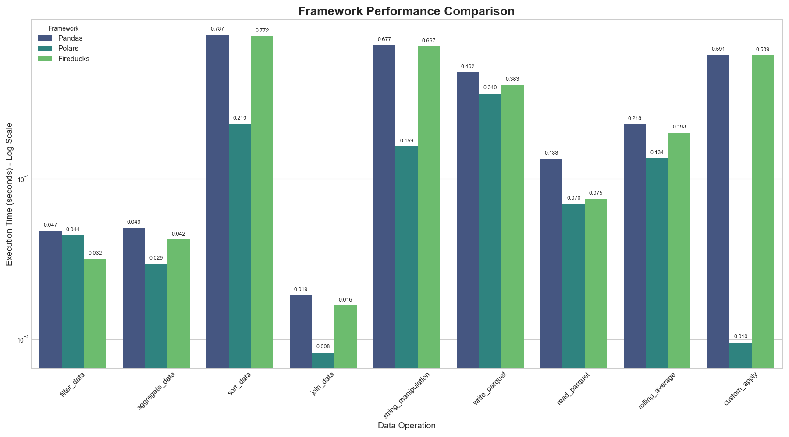

# Comparativa de Rendimiento: Pandas vs. Polars vs. Fireducks

Este repositorio contiene un benchmark de rendimiento para comparar tres populares librerías de manipulación de datos en Python: **Pandas**, **Polars** y **Fireducks**.

El objetivo es evaluar la eficiencia y la facilidad de uso en una serie de operaciones comunes y avanzadas, determinando si Fireducks cumple su promesa de acelerar el código de Pandas sin necesidad de cambios en la sintaxis.

## Resultados

A continuación, se muestra una comparativa visual del tiempo de ejecución (en segundos, escala logarítmica) para diferentes operaciones en un DataFrame de 5 millones de filas.



### Operaciones Analizadas:

- **Computacionales**: `filter`, `aggregate`, `sort`, `join`, `string_manipulation`.
- **I/O**: `write_parquet`, `read_parquet`.
- **Avanzadas**: `rolling_average` (función de ventana), `custom_apply` (función personalizada).

## Análisis Detallado

La siguiente tabla muestra los tiempos de ejecución y el factor de **speedup** (cuántas veces más rápido) de Polars y Fireducks en relación con Pandas. Un speedup de 62x significa que la operación fue 62 veces más rápida.

| Operación             | Pandas (s) | Polars (s) | Fireducks (s) | Speedup Polars  | Speedup Fireducks |
| --------------------- | ---------- | ---------- | ------------- | --------------- | ----------------- |
| `filter_data`         | 0.047      | 0.044      | **0.032**     | 1.07x           | **1.47x**         |
| `aggregate_data`      | 0.049      | **0.029**  | 0.042         | **1.68x**       | 1.17x             |
| `sort_data`           | 0.787      | **0.219**  | 0.772         | **3.60x**       | 1.02x             |
| `join_data`           | 0.019      | **0.008**  | 0.016         | **2.32x**       | 1.19x             |
| `string_manipulation` | 0.677      | **0.159**  | 0.667         | **4.26x**       | 1.02x             |
| `write_parquet`       | 0.462      | **0.340**  | 0.383         | 1.36x           | 1.21x             |
| `read_parquet`        | 0.133      | **0.070**  | 0.075         | **1.90x**       | **1.77x**         |
| `rolling_average`     | 0.218      | **0.134**  | 0.193         | **1.63x**       | 1.13x             |
| `custom_apply`        | 0.591      | **0.0095** | 0.589         | **62.21x**      | 1.00x             |

*Resultados obtenidos en un MacBook Air (M1) con 16GB de RAM.*

### Nota sobre `custom_apply` y la Filosofía de Polars

El resultado de la operación `custom_apply` es el más revelador. Inicialmente, se implementó con `map_elements` en Polars (equivalente a `.apply` de Pandas), lo que resultaba en un speedup de solo ~2x. Sin embargo, al refactorizarlo para usar la **expresión nativa de Polars** (`(pl.col("col_0") * 2) + 1`), el rendimiento se disparó a ser **más de 62 veces más rápido que Pandas**. Esto demuestra que para exprimir el verdadero potencial de Polars, es crucial adoptar su API de expresiones y evitar patrones lentos como las funciones `apply` de Python.

## Conclusiones Finales

1.  **Polars es el rey indiscutible del rendimiento:** Para obtener la máxima velocidad, especialmente si estás dispuesto a aprender su API de expresiones, Polars es la mejor opción. Su rendimiento en operaciones vectorizadas es espectacular.

2.  **Fireducks es un excelente acelerador de Pandas, sobre todo en I/O:** Si tienes una base de código en Pandas y buscas una mejora de rendimiento con un esfuerzo mínimo, Fireducks es una opción fantástica. Brilla especialmente en la lectura de archivos (`1.77x` más rápido) y en operaciones de filtrado (`1.47x`).

3.  **Elige la herramienta adecuada para el trabajo:**
    *   **Para proyectos nuevos y con uso intensivo de datos:** Empieza con **Polars**.
    *   **Para acelerar proyectos de Pandas existentes:** Integra **Fireducks**.
    *   **Para análisis exploratorio rápido y ecosistema:** **Pandas** sigue siendo una opción viable y universal.

## Cómo Replicar los Resultados

Si deseas ejecutar este benchmark en tu propia máquina, sigue estos pasos:

1.  **Clona el repositorio:**
    ```bash
    git clone https://github.com/tu-usuario/fireducks_vs_polar_vs_pandas.git
    cd fireducks_vs_polar_vs_pandas
    ```

2.  **Crea un entorno virtual e instala las dependencias:**
    ```bash
    uv venv --seed
    source .venv/bin/activate
    .venv/bin/pip install -r requirements.txt
    ```

3.  **Ejecuta el script de benchmark:**
    ```bash
    .venv/bin/python benchmark.py
    ```

    El script generará los resultados en la consola y guardará la gráfica y un CSV con los datos en la carpeta `figures/`.
