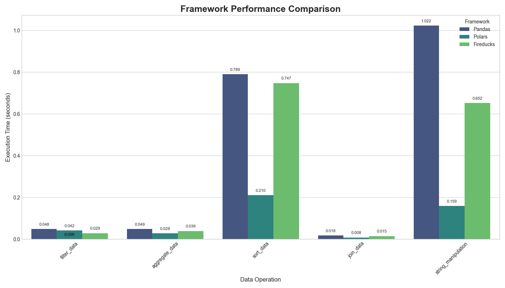

# Comparativa de Rendimiento: Pandas vs. Polars vs. Fireducks

Este repositorio contiene un benchmark de rendimiento para comparar tres populares librerías de manipulación de datos en Python: **Pandas**, **Polars** y **Fireducks**.

El objetivo es evaluar la eficiencia y la facilidad de uso, especialmente para determinar si Fireducks cumple su promesa de acelerar el código de Pandas sin necesidad de cambios en la sintaxis.

## Resultados

A continuación, se muestra una comparativa visual del tiempo de ejecución (en segundos) para diferentes operaciones de datos en un DataFrame de 5 millones de filas.



### Operaciones Analizadas:

- **`filter_data`**: Filtrado de filas basado en una condición.
- **`aggregate_data`**: Agrupación y agregación de datos.
- **`sort_data`**: Ordenamiento del DataFrame por una columna.
- **`join_data`**: Unión de dos DataFrames.
- **`string_manipulation`**: Creación de una nueva columna mediante la manipulación de strings.


## Análisis Detallado

Para cuantificar la mejora, la siguiente tabla muestra los tiempos de ejecución y el factor de "speedup" (cuántas veces más rápido) de Polars y Fireducks en relación con Pandas. Un speedup de 2.0x significa que la operación fue el doble de rápida.

| Operación             | Pandas (s) | Polars (s) | Fireducks (s) | Speedup Polars | Speedup Fireducks |
| --------------------- | ---------- | ---------- | ------------- | -------------- | ----------------- |
| `filter_data`         | 0.048      | 0.042      | 0.029         | **1.15x**      | **1.67x**         |
| `aggregate_data`      | 0.049      | 0.028      | 0.039         | **1.75x**      | **1.26x**         |
| `sort_data`           | 0.789      | 0.210      | 0.747         | **3.76x**      | 1.06x             |
| `join_data`           | 0.018      | 0.008      | 0.015         | **2.25x**      | 1.20x             |
| `string_manipulation` | 1.022      | 0.159      | 0.652         | **6.43x**      | **1.57x**         |

*Resultados obtenidos en un MacBook Pro (M1) con 16GB de RAM.*

## Conclusiones

1.  **Polars**: Es el framework más rápido en todas las pruebas, destacando especialmente en operaciones de ordenamiento y manipulación de strings, donde supera ampliamente a los demás.

2.  **Fireducks**: Se posiciona como un "acelerador" de Pandas muy eficaz. Ofrece mejoras de rendimiento significativas sobre Pandas en la mayoría de las operaciones, con la gran ventaja de no requerir ninguna modificación en el código original. Simplemente con `import fireducks`, el código de Pandas se ejecuta más rápido.

3.  **Pandas**: Aunque es el más lento en esta comparativa, sigue siendo el estándar de la industria con una API muy conocida y un ecosistema robusto. Su rendimiento es adecuado para conjuntos de datos de tamaño pequeño a mediano.

## Cómo Replicar los Resultados

Si deseas ejecutar este benchmark en tu propia máquina, sigue estos pasos:

1.  **Clona el repositorio:**
    ```bash
    git clone <URL-DEL-REPOSITORIO>
    cd <NOMBRE-DEL-REPOSITORIO>
    ```

2.  **Crea un entorno virtual e instala las dependencias:**
    Este proyecto utiliza `uv` para la gestión del entorno virtual.
    ```bash
    # Crear el entorno
    uv venv --seed

    # Activar el entorno (en macOS/Linux)
    source .venv/bin/activate

    # Instalar las librerías
    .venv/bin/pip install -r requirements.txt
    ```
    *(Nota: Se necesitará un archivo `requirements.txt` que puedes generar con `.venv/bin/pip freeze > requirements.txt`)*

3.  **Ejecuta el script de benchmark:**
    ```bash
    .venv/bin/python benchmark.py
    ```

    El script generará los resultados en la consola y guardará la gráfica comparativa en la carpeta `figures/`.
